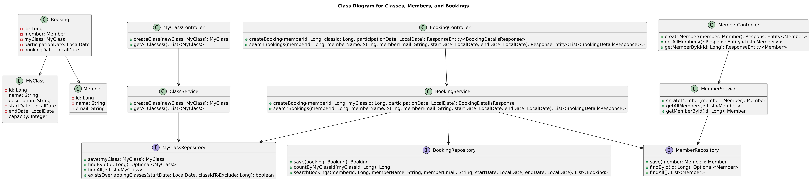
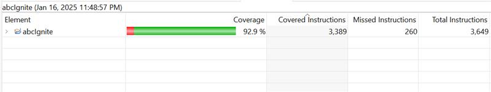
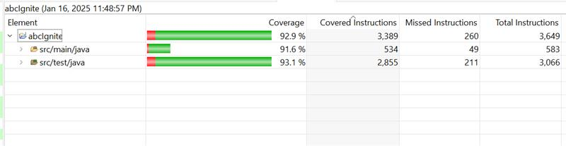

---

# ABC Ignite: Seamless Fitness Class Management API

**ABC Ignite** is a Spring Boot application designed for managing classes and members in a fitness or educational center. The application follows a layered architecture, including models, repositories, and services, to ensure a clean separation of concerns.

## Table of Contents

- [Features](#features)
- [Technologies used](#technologies-used)
- [Setup](#setup)
- [API Documentation](#api-documentation)
- [Database Configuration](#database-configuration)
- [Validation Rules](#validation-rules)
- [Code_coverage](#code_coverage)
- [Future Improvements](#future-improvements)

### Architecture Diagram



## Features

- Create and manage fitness classes (e.g., Yoga, Zumba), including class details such as name, start date, end date, start time, duration, and capacity.
- Book a spot in a class with member details (name, class_id) and ensures class capacity is not exceeded.
- RESTful APIs for creating, updating, and retrieving classes and bookings.
- In-memory data management with H2 database for quick and easy testing.
- OpenAPI integration for automatic API documentation and Swagger UI for endpoint exploration.
- Custom error handling to provide better debugging and meaningful user feedback.
- Data validation rules to ensure the accuracy and integrity of all user inputs.
- Test coverage of over **92%** to ensure robustness and stability of the application.


## Technologies used

- **Java 17**
- **Spring Boot**: For building RESTful APIs.
- **Spring Data JPA**: manage entities, automate data access, and handle complex queries
- **H2 Database**: In-memory database for testing.
- **Swagger UI**: API documentation and testing.
- **Maven**: Dependency management and build automation.

## Setup

### Prerequisites

- Java 17 installed.
- Maven installed.

### Running the Application

1. Clone the repository:
   ```bash
   git clone https://github.com/AcceleratingOnwards/ABC-Ignite.git
   cd ABC-Ignite
   ```

2. Build the project:
   ```bash
   mvn clean install
   ```

3. Run the application:
   ```bash
   mvn spring-boot:run
   ```

4. Access the Swagger UI for API documentation:
    - URL: [http://localhost:8080/swagger-ui/index.html](http://localhost:8080/swagger-ui/index.html)

5. Access the H2 database console:
    - URL: [http://localhost:8080/h2-console](http://localhost:8080/h2-console)
    - JDBC URL: `jdbc:h2:mem:testdb`
    - Username: `sa`
    - Password: `password`


## API DocumentationAPI Documentation

### Class Endpoints
- *POST /classes*: Create a new class.
    - *Sample request body*:
      ```json
      {
      "name": "Pilates",
      "startDate": "2025-01-17",
      "endDate": "2025-01-17",
      "startTime": "06:30:00",
      "durationInMinutes": 60,
      "capacity": 20
      }


- *Possible Responses*:
    - *201 Created*: If the class is created successfully.


- *GET /classes*: Retrieve all classes.
	 - *Sample response body*:
```json
{
  "id": 1,
  "name": "Yoga Class",
  "startDate": "2025-01-01",
  "endDate": "2025-01-31",
  "startTime": "08:00:00",
  "durationInMinutes": 60,
  "capacity": 20
}
```


### Member Endpoints
•	POST /api/members: Create a new member.
•	Sample request body:

```json
{
"name": "Jane Smith",
"email": "jane.smith@example.com"
}
```


- *Possible Responses*:
    - *201 Created*: If the member is created successfully.

```json
{
"id": 2,
"name": "Jane Smith",
"email": "jane.smith@example.com"
}
```


•	GET /api/members/{id}: Update an existing member by ID.


- *Possible Responses*:
	- *200 OK*: If the member is updated successfully.

```json
{
  "id": 1,
  "name": "John Doe",
  "email": "john.doe@example.com"
}
```
•	GET /api/members: Get all members


- *Possible Responses*:
	- *200 OK*: If the member is updated successfully.

```json
{
  "id": 1,
  "name": "John Doe",
  "email": "john.doe@example.com"
}
```


### Booking Endpoints
- *POST /api/bookings*: Create a new booking.


- *Possible Responses*:

  - *201 Created*: If the booking is created successfully.

```json
{
  "memberName": "John Doe",
  "className": "Yoga Class",
  "classStartTime": "08:00:00",
  "bookingDate": "2025-01-17",
  "participationDate": "2025-01-03"
}
```

- *GET /api/bookings*: Get Booking Details


- *Possible Responses*:

  - *201 Created*: Fetched Booking Details Successfully

```json
{
    "memberName": "John Doe",
    "className": "Yoga Class",
    "classStartTime": "08:00:00",
    "bookingDate": "2025-01-01",
    "participationDate": "2025-01-02"
  },
  {
    "memberName": "Jane Smith",
    "className": "HIIT Workout",
    "classStartTime": "10:00:00",
    "bookingDate": "2025-01-03",
    "participationDate": "2025-03-05"
  },
  {
    "memberName": "Mike Jones",
    "className": "Meditation Session",
    "classStartTime": "06:30:00",
    "bookingDate": "2025-01-04",
    "participationDate": "2025-04-03"
  }
```


## Database Configuration

The project uses H2 as an in-memory database for simplicity and ease of testing. Initial data is preloaded using `data.sql`, so some classes, members and bookings will already be present when the application starts.

## Validation Rules

    •	Class Name: Cannot be empty.
    •	Start and End Dates:
    •	Start date must be before or equal to the end date.
    •	End date must be in the future.
    •	Capacity: Must be a positive integer.
    •	Class Overlap: Only one class is allowed per day.
## Code_coverage


## Future Improvements

- **Handle Overbooking**: Add a feature to handle overbooking scenarios by preventing class bookings once the capacity is reached, and potentially implement a waitlist feature for members who want to book a full class.
- **Concurrency Handling**: Implement mechanisms to handle concurrent access to resources, ensuring that multiple users do not book the same spot in a class at the same time, maintaining data consistency.
- **Introduce Soft Deletion with `isActive` Flag**: Add an `isActive` field to the Class and Booking entities. This will allow soft deletion, marking records as inactive rather than deleting them entirely, which can be useful for auditing or tracking historical data.
- **Prevent Duplicate Bookings**: Enhance the Booking API with a validation rule that ensures a member cannot book the same class for the same date multiple times, preventing duplicate records and maintaining clean data.
- **Integrate a Persistent Database**: Replace the in-memory data store with a relational database like PostgreSQL or MySQL to ensure data persistence, scalability, and production readiness.
- **Implement Pagination for Search Results**: Add pagination support for class and booking search APIs, allowing users to retrieve large datasets efficiently without performance degradation.
- **Introduce User Authentication**: Implement authentication to secure the API, ensuring only authorized users (e.g., club owners, members) can perform certain actions like creating or managing classes and bookings.


## License

This project is licensed under the MIT License.

---